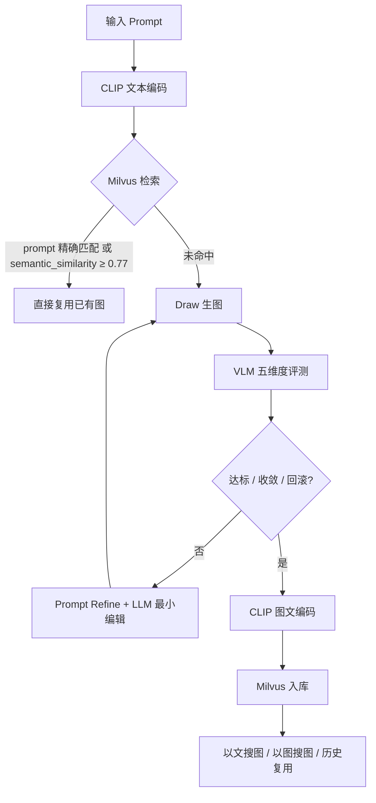

# 图像生成优化系统 — Picture Optimizer

> **生图 → VLM 评测 → Prompt 修正 → 向量检索复用** 的图片生成闭环系统。  
> 详细设计见 [项目计划书.md](项目计划书.md)。

---

## 目录

- [这是什么](#这是什么)
- [核心流程](#核心流程)
- [快速开始](#快速开始)
- [本地开发](#本地开发)
- [Demo 命令](#demo-命令)
- [API 参考](#api-参考)
- [Pipeline 模式](#pipeline-模式)
- [配置参考](#配置参考)
- [项目结构](#项目结构)
- [模块状态](#模块状态)

---

## 这是什么

picture2 接收上游模块（Design / Materialize）产出的**自然语言图片描述**，完成：

1. **生图** — 通义万相 / 豆包 Seedream
2. **评测** — VLM 五维度打分 + 可选 VLM 复核
3. **修正** — 策略分析 + LLM 最小编辑（每轮 top-3 issue）
4. **入库与复用** — Chinese-CLIP 编码 → Milvus 存储 → 语义检索命中则跳过生图

配套 **FastAPI 后端** 与 **Milvus Admin 前端**（集合管理、检索、素材入库、图库浏览）。

---

## 核心流程

### clip_enrich 模式（生产推荐）



### 素材入库路径（v6 泛化）

上传任意图片 → VLM 内容解析 → 构建 `semantic_text` → CLIP 双向量编码（`image_embedding` + `semantic_embedding`）→ Milvus → 与 AI 生成图统一混合检索（加权 **0.7×语义 + 0.2×图像 + 0.1×标签**）。

---

## 快速开始

**环境要求**：Python ≥ 3.11、pip；可选 Docker（Milvus Standalone）、Node.js 18+（Admin 前端）。

```powershell
# 1. 进入目录并安装依赖
cd picture2
pip install -e ".[dev,phase2]"

# 2. 配置密钥：复制 .env.example → .env
#    豆包/LLM 可复用仓库根 .env 的 ARK_API_KEY
#    通义需填 TONGYI_API_KEY

# 3. （可选）国内下载 CLIP 前设 HuggingFace 镜像
$env:HF_ENDPOINT = "https://hf-mirror.com"

# 4. 启动 Milvus（推荐；亦可用 Milvus Lite 本地 .db）
docker compose up -d

# 5. 跑全链路 Demo 入库（见下文「推荐 Demo」）
python -m demo.upstream_simulator_demo --mode pipeline --subject all --with-clip

# 6. Demo 完成后启动服务
uvicorn src.main:app --reload --port 8000          # API → http://localhost:8000
cd apps/milvus-admin && npm install && npm run dev  # Admin → http://localhost:5173
```

> **首次运行**：Chinese-CLIP（`CLIP_MODEL_NAME`，默认 base-patch16 ~400MB）首次会自动从 HuggingFace 下载。

---

## 本地开发

### 推荐启动顺序

| 步骤 | 做什么 | 命令 |
|------|--------|------|
| 0 | Milvus | `docker compose up -d` |
| 1 | **Demo 入库** | `python -m demo.upstream_simulator_demo --mode pipeline --subject all --with-clip` |
| 2 | API | `uvicorn src.main:app --reload --port 8000` |
| 3 | Admin | `cd apps/milvus-admin && npm run dev` |

Demo 跑完后再开 API 与 Admin，可在界面浏览已入库向量与图片。

### Milvus 运维

```powershell
docker compose up -d      # 启动（数据在 storage/milvus_data/）
docker compose down       # 停止
python -m demo.inspect_milvus          # 查看最近记录
python -m demo.inspect_milvus --drop   # 清空（谨慎）
```

### 维护脚本（`scripts/`）

| 脚本 | 用途 |
|------|------|
| `rebuild_milvus_db.py` | 重建 Milvus 集合 |
| `migrate_add_subject.py` | [DEPRECATED v6] 旧版学科字段迁移（新项目无需运行） |
| `benchmark_milvus.py` | 检索性能基准 |
| `cleanup_milvus.ps1` | 清理本地 Milvus 数据 |

---

## Demo 命令

所有命令均在 `picture2/` 目录下执行。

### 推荐 Demo — 上游模拟器（多分类 · 28 条 prompt）

模拟上游模块生成图片描述，覆盖风景/人物/动物/科技/美食/建筑/艺术等多个分类。

```powershell
# 列出全部 prompt ID
python -m demo.upstream_simulator_demo --mode list
python -m demo.upstream_simulator_demo --mode list --category 风景

# 零 API 调用，验证流程
python -m demo.upstream_simulator_demo --mode dry-run

# ★ 全分类全链路：检索复用 → 生图 → 评测 → Refine → CLIP → Milvus
python -m demo.upstream_simulator_demo --mode pipeline --category all --with-clip

# 单分类 / 单条
python -m demo.upstream_simulator_demo --mode pipeline --category 科技 --with-clip
python -m demo.upstream_simulator_demo --mode pipeline --category 美食 --id food_ramen --with-clip

# 仅生图（不走评测闭环）
python -m demo.upstream_simulator_demo --mode direct --category 风景 --id scenery_sunset
```

| 分类 | `--category` | 示例 `--id` |
|------|-------------|-------------|
| 风景 | `scenery` | `scenery_sunset` |
| 人物 | `portrait` | `portrait_studio` |
| 动物 | `animal` | `animal_wildlife` |
| 科技 | `tech` | `tech_circuit` |
| 美食 | `food` | `food_ramen` |
| 建筑 | `architecture` | `arch_modern` |
| 艺术 | `art` | `art_painting` |

完整 ID 列表请用 `--mode list` 查看。

### Phase 1 — 仅生图

```powershell
python -m demo.geography_demo --model tongyi
python -m demo.geography_demo --model tongyi --only geo_lat_lon_earth
```

### Phase 2 — 评测与闭环（`phase2_geography_demo`）

```powershell
# 逐步：生图 → 评测 → Refine（top-3 issue）
python -m demo.phase2_geography_demo --mode step --category 科技 --id tech_circuit --lang zh

# 闭环：自动迭代至达标 / 收敛 / 回滚
python -m demo.phase2_geography_demo --mode pipeline --category 科技 --id tech_circuit --lang zh --max-iter 3

# 闭环 + CLIP + Milvus
python -m demo.phase2_geography_demo --mode pipeline --category 科技 --id tech_circuit --with-clip-milvus
python -m demo.phase2_geography_demo --mode pipeline --category 科技 --id tech_circuit --dry-run --with-clip-milvus

# 仅评测已有图片（不生图）
python -m demo.phase2_geography_demo --mode evaluate-only `
    --image "storage\images\tongyi_xxx.png" `
    --prompt "城市夜景航拍照片..." --lang zh
```

**Phase 2 可用插图 ID**（部分）：

| 分类 | ID | 标题 |
|------|-----|------|
| 风景 | `scenery_sunset` | 日落风景图 |
| 科技 | `tech_circuit` | 电路板特写图 |
| 美食 | `food_ramen` | 日式拉面图 |

更多见 `demo/phase2_geography_demo.py` 内 `CATEGORY_ILLUSTRATIONS`。

### 工具类 Demo

```powershell
# CLIP + Milvus 独立测试
python -m demo.clip_milvus_demo --mode dry-run
python -m demo.clip_milvus_demo --mode real --image storage/images/xxx.png

# VLM 属性复核
python -m demo.vlm_verify_test --image "storage\images\xxx.png" --missing "红色标注,蓝色虚线" --lang zh
```

### 单元测试

```powershell
python -m pytest tests/ -v
python -m pytest tests/test_draw.py tests/test_phase2.py tests/test_milvus.py -v

# Admin E2E（需 API + Admin 已启动）
cd apps/milvus-admin && npm run test:e2e
```

---

## API 参考

| 方法 | 路径 | 说明 |
|------|------|------|
| GET | `/health` | 健康检查 |
| POST | `/draw` | 生图（返回 `record_id`） |
| GET | `/records` | 最近生图记录 |
| GET | `/records/{id}` | 单条记录 |
| POST | `/feedback` | 人工反馈 |
| POST | `/evaluate` | VLM 五维度评测 |
| POST | `/pipeline` | 闭环（见 [Pipeline 模式](#pipeline-模式)） |
| POST | `/search` | 相似图检索 |
| POST | `/api/search/semantic` | 语义检索（加权 0.7/0.2/0.1） |
| POST | `/api/upload_material` | 图片素材入库 |
| GET | `/api/search/history` | 检索历史 |
| GET | `/api/search/subjects` | [DEPRECATED v6] 学科列表（兼容旧版，新代码使用 `/api/search/categories`） |
| GET | `/api/search/categories` | 分类列表（v6 新增） |
| GET/POST | `/api/milvus/*` | Milvus CRUD |
| WS | `/ws/milvus` | WebSocket 状态推送 |

交互文档：启动 API 后访问 `http://localhost:8000/docs`。

---

## Pipeline 模式

`POST /pipeline` 请求体字段 `mode`（定义见 `src/models/schemas.py`）：

| 模式 | 行为 | 典型场景 |
|------|------|----------|
| `direct` | 只生图，不评测、不检索 | **API 默认值**；`/pipeline/async` 强制此模式 |
| `evaluate_loop` | Draw → VLM 评测 → Refine 循环 | Demo、质量闭环验证 |
| `clip_enrich` | 检索复用优先 → 未命中则 evaluate_loop → 入库 | **生产推荐**；需 Milvus + CLIP |

`clip_enrich` 复用判定（按顺序）：

1. **精确 prompt 匹配**：同 prompt 最高分记录，且 `overall_score ≥ clip_min_score`（默认 **0.75**）且图片文件存在
2. **语义近似**：`search_by_semantic` top-1 的 `semantic_similarity ≥ reuse_threshold`（默认 **0.77**）且文件存在

命中则 `stopped_reason=reused`，`total_iterations=0`，跳过后续生图与评测。

---

## 配置参考

### Chinese-CLIP

默认见 `src/config.py` / `.env.example`：

| 项目 | 默认值 |
|------|--------|
| 模型 | `OFA-Sys/chinese-clip-vit-base-patch16` |
| 维度 | **512** |
| 输入 | 224×224 |
| 用途 | **仅 Milvus 向量检索**，不参与 VLM 评测 |

可通过 `CLIP_MODEL_NAME` 切换为 `vit-large-patch14`（768-d）等；维度由 `config.py` 自动推导。`CLIP_DEVICE` / `CLIP_USE_FP16` 控制推理设备与半精度。

### VLM 评测

五维度（0–1）：主体对象、属性、空间关系、场景完整性、整体语义。

| 规则 | 默认值 |
|------|--------|
| 达标阈值 `EVAL_THRESHOLD` | **0.82** |
| 每轮处理 issue 数 `MAX_ISSUES_PER_ROUND` | **3** |
| 收敛判定 `CONVERGENCE_DELTA` | **0.01** |
| 分数回滚 `SCORE_ROLLBACK_DELTA` | **0.05**（较历史 best 下降超过则回滚并停止） |
| 最大迭代 `max_iterations` | **3**（请求体 / Demo 参数） |

最终输出取**历史最高评分**对应的 prompt / 图片（非最后一轮）。

### 常用环境变量

| 变量 | 默认 | 说明 |
|------|------|------|
| `MILVUS_URI` | `http://localhost:19530` | Milvus 连接 |
| `LLM_MODEL` | `doubao-seed-2-0-lite-260215` | Refiner / Adjuster |
| `VLM_EVAL_MODEL` | `doubao-seed-1-6-vision-250815` | 评测 VLM |
| `EVAL_THRESHOLD` | `0.82` | 达标早停 |
| `reuse_threshold` | `0.77` | **请求体字段**：语义复用阈值 |
| `clip_min_score` | `0.75` | **请求体字段**：复用最低评测分 |

完整列表见 [.env.example](.env.example)。

---

## 项目结构

```
picture2/
├── src/                    # Python 后端
│   ├── main.py             # FastAPI 入口
│   ├── pipeline.py         # 闭环控制器
│   ├── draw/               # 生图（豆包 / 通义）
│   ├── evaluate/           # VLM 评测 + Chinese-CLIP
│   ├── refiner/            # Prompt 策略分析与 LLM 最小编辑
│   ├── milvus/             # 向量存储 + 内容语义解析
│   ├── api/                # REST + WebSocket 路由
│   ├── storage/            # JSON 记录持久化
│   └── models/             # Pydantic Schema
├── apps/milvus-admin/      # React 管理前端（7 页面）
├── demo/                   # 本地 Demo 与集成测试入口
├── scripts/                # Milvus 维护脚本
├── tests/                  # pytest + Playwright E2E
├── storage/images/         # 生成图片
├── docker-compose.yml      # Milvus Standalone
├── .env.example
└── pyproject.toml
```

---

## 模块状态

| 模块 | 状态 | 说明 |
|------|------|------|
| Draw | ✅ | 豆包 Seedream + 通义万相 |
| Evaluate | ✅ | VLM 五维度 + Chinese-CLIP |
| VLM Verify | ✅ | 豆包视觉复核属性可见性 |
| Refiner | ✅ | 策略分析 + 最小编辑（top-3 / 轮） |
| Pipeline | ✅ | `direct` / `evaluate_loop` / `clip_enrich` |
| Milvus | ✅ | Lite / LocalNumpy / Server 三后端 |
| Content Parser | ✅ | 上传图 → 分类/关键词/检索描述 |
| Material Upload | ✅ | 素材双向量入库 |
| Semantic Search | ✅ | semantic 主检索 + 加权排序 |
| Milvus Admin | ✅ | 集合 / 分区 / 索引 / 数据 / 检索 / 图库 / 素材 |
