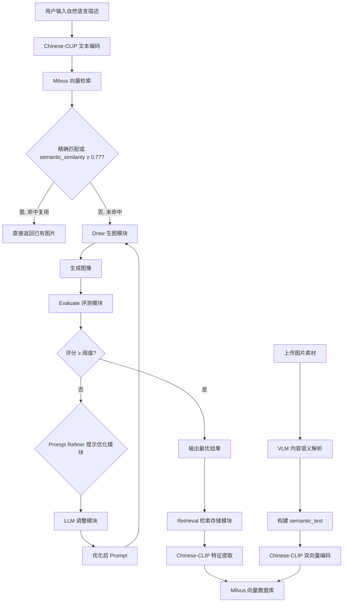
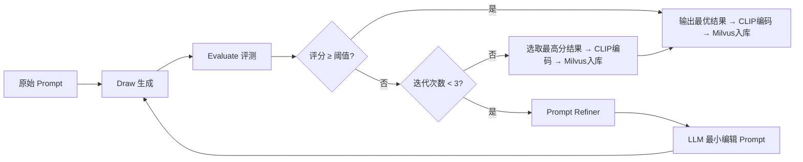

# 项目计划书

## 一、项目概述

本项目拟构建一个基于 **"大模型生成—自动评估—提示优化—迭代重绘—向量检索"** 的闭环式智能图像生成系统。系统以自然语言描述的图片内容作为输入，通过生图模型生成图像，并结合视觉语言模型（Vision Language Model, VLM）对生成结果进行自动评估，判断图像内容与用户自然语言描述之间的一致性。在评估结果不满足要求时，系统自动分析当前生成结果存在的问题，并通过大语言模型（LLM）动态调整图像描述提示词（Prompt），重新驱动图像生成模块进行迭代优化。最终系统在限定迭代次数内输出评分最高的生成结果，并进一步利用 Chinese-CLIP 提取图文语义特征，实现图像检索与向量化存储，构建可扩展的图像向量数据库。

本项目的核心目标在于解决传统文本生成图像（Text-to-Image）过程中存在的 **"生成结果不可控、图文一致性不足以及缺乏自动优化能力"** 等问题，通过建立自动反馈机制，提高各类场景下图像生成的准确性与可用性。

此外，本项目还扩展了 **素材图片入库** 能力（v5）：支持用户直接上传任意场景的图片素材（照片、插图、设计稿、文档截图等），通过 VLM 自动理解图片内容语义，经 Chinese-CLIP 向量化后存入 Milvus，使上传素材与 AI 生成图在统一知识库中混合检索，实现自然语言精准召回。

---

## 二、系统总体架构

系统整体采用模块化设计，由 **Draw 生图模块**、**Evaluate 评测模块**、**Prompt Refiner 提示优化模块**、**LLM 调整模块** 以及 **Retrieval 检索存储模块** 组成，形成完整的自动优化闭环。

### 2.1 系统流程概览



> **两条入库路径**：① AI 生成图：先检索 Milvus，命中则直接复用已有图片（零成本），未命中则走 Draw → Evaluate → Refine 闭环后入库；② 用户上传的各类图片素材经 VLM 内容语义解析后直接入库。两者在 Milvus 中统一存储、混合检索。

### 2.2 核心流程说明

0. **检索复用检查（v5.1 新增）**：系统接收到自然语言描述后，首先通过 Chinese-CLIP 将文本编码为特征向量，到 Milvus 向量数据库检索相似图片。复用判定分两步：① 同 prompt 精确匹配且评测分 ≥ `clip_min_score`（默认 0.75）；② 语义近似检索后 top-1 的 `semantic_similarity ≥ reuse_threshold`（默认 **0.77**）。任一命中且图片文件存在则**直接返回已有图片**，跳过全部生图/评测/迭代流程。

1. **未命中则进入生图**：若 Milvus 中无足够相似的图片，系统将**原始 Prompt** 输入至绘图模块（Draw）。绘图模块内部调用千问（Qwen）生图大模型 API，根据输入文本生成对应图像。生成完成后，系统将输出图像与原始文本描述共同送入 Evaluate 模块。

2. Evaluate 模块基于视觉语言模型（VLM）对图像内容进行语义一致性检测，评估生成结果是否满足用户描述要求。评测内容包括图像主体完整性、元素准确性、空间关系正确性、文本描述覆盖程度以及整体语义匹配度，并输出结构化评分结果与缺陷分析信息。

3. 随后，系统根据 Evaluate 模块输出的检测结果，自动生成对应的 Prompt 调整策略。例如，当模型检测到缺失关键元素、构图偏差或视觉表达不准确时，系统会形成针对性的优化建议，并输入至大语言模型（LLM）。LLM 根据当前问题自动重构或增强自然语言描述，生成新的 Prompt，以提高下一轮图像生成质量。

4. 经过 Prompt 优化后的描述将重新输入 Draw 模块，完成下一轮图像生成。系统按照 **"生成—评测—优化"** 的流程进行循环迭代，直至满足任一终止条件。

### 2.3 终止条件

- Evaluate 模块评分高于预设阈值（默认 **0.82**，`EVAL_THRESHOLD`）；
- 达到最大迭代次数（最多 **3 次**）。

在循环结束后，系统从所有生成结果中选取评分最高的图像作为最终输出结果，以保证系统在有限计算资源下获得最优生成效果。

### 2.4 检索存储

最终输出图像将进入 Retrieval 检索存储模块。该模块采用 Chinese-CLIP 模型提取图像与文本的跨模态特征向量，实现图文统一语义空间映射。随后，通过 Milvus 向量数据库对图像特征向量进行存储与索引，以支持后续的相似图片检索、内容复用以及语义级图像搜索功能。

---

## 三、模块设计

### 3.1 Draw 生图模块

| 属性 | 说明 |
|------|------|
| **功能定位** | 根据输入的自然语言描述生成目标图像 |
| **核心技术** | 千问（Qwen）生图大模型 API |
| **输入** | 用户自然语言描述 / 经 LLM 优化后的 Prompt |
| **输出** | 生成图像 |

#### 核心任务

- 接收自然语言图像描述；
- 调用千问生图模型 API 完成图像生成；
- 返回生成图像；
- 记录每轮生成结果及对应参数，用于后续评测与最佳结果筛选。

---

### 3.2 Evaluate 自动评测模块

Evaluate 模块用于判断当前生成图像是否符合自然语言描述要求，是整个闭环优化系统的关键模块。

系统将生成图像与原始文本描述同时输入视觉语言模型（VLM），由模型对图像内容进行语义理解与匹配评估。评测结果不仅输出整体分数，还需给出细粒度检测内容，为后续 Prompt 调整提供依据。

#### 评测维度

| 维度 | 说明 |
|------|------|
| **主体对象一致性** | 图像是否包含描述中的关键主体 |
| **属性一致性** | 颜色、大小、形状、数量等属性是否正确 |
| **空间关系一致性** | 对象位置关系是否满足描述 |
| **场景完整性** | 背景与环境是否符合要求 |
| **整体语义匹配度** | 图像与文本之间的综合相关程度 |

#### 模块输出

- 全局评测分数（Score）；
- 错误项分析；
- 缺失元素说明；
- Prompt 调整建议。

---

### 3.3 Prompt Refiner 提示优化模块

Prompt Refiner 模块负责基于 Evaluate 输出结果生成针对性的 Prompt 修改策略。

模块通过解析 VLM 的检测信息，对当前 Prompt 中存在的问题进行归因分析：

| 问题类型 | 优化策略 |
|----------|----------|
| 缺失对象 | 增强主体强调 |
| 属性错误 | 强化颜色/形态约束 |
| 构图偏差 | 增加位置关系描述 |
| 风格不一致 | 补充风格限制词 |

最终输出结构化优化建议，用于指导后续 LLM 的 Prompt 改写。

---

### 3.4 LLM Prompt 调整模块

LLM 模块负责根据 Prompt Refiner 提供的优化策略，对**当前轮** prompt 进行**最小编辑**式局部修正（禁止整段重写）。

采用 **语义级局部修补** 方式：每轮最多处理 top-3 severe issue，在保持原始任务目标与 ≥90% 原文不变的前提下，插入短语/clause 提高描述清晰度与可生成性。

#### 优化示例

> **原始 Prompt**：一幅城市夜景照片
>
> **优化后 Prompt**：一幅专业摄影风格的城市夜景照片，画面中心为现代化天际线建筑群，包含明亮的写字楼灯光、车流光轨与湖面倒影，背景深蓝色夜空，氛围宁静且具有科技感。

优化后的 Prompt 将重新输入 Draw 模块，进入下一轮生成。

---

## 四、闭环迭代机制

系统采用基于评分反馈的自动迭代优化机制。

### 4.1 迭代流程

> 以下为 **Milvus 检索未命中复用阈值** 后的生图迭代流程。若检索命中（精确 prompt 或 `semantic_similarity ≥ 0.77`），则跳过此流程，直接返回已有图片。



### 4.2 终止规则

| 条件 | 操作 |
|------|------|
| Evaluate Score ≥ 设定阈值（默认 **0.82**） | 提前结束迭代 |
| \|本轮分 - 上轮分\| < 0.01 | 收敛停止 |
| 分数较历史最佳下降 > **0.05** | 回滚 `best_prompt` 并停止（`score_regression`） |
| 达到最大迭代次数（3 次） | 停止优化 |
| 迭代结束 | 在所有生成结果中选择**最高评分**结果作为最终输出 |

该机制能够有效提高生成图像的稳定性与图文一致性，同时控制推理成本。

### 4.3 Pipeline API 运行模式

`POST /pipeline` 通过请求体字段 `mode` 选择行为（定义见 `src/models/schemas.py`）：

| 模式 | 说明 |
|------|------|
| `direct` | 仅生图，不评测、不检索。**HTTP API 默认值** |
| `evaluate_loop` | Draw → Evaluate → Refine 循环（Demo 与质量闭环） |
| `clip_enrich` | 检索复用优先 → 未命中则 `evaluate_loop` → CLIP 编码入库（生产推荐） |

`clip_enrich` 复用参数：`reuse_threshold` 默认 **0.77**（`semantic_similarity`），`clip_min_score` 默认 **0.75**。

---

## 五、检索与向量数据库模块

在获得最终图像后（或用户上传素材后），系统将执行图像向量化与检索存储。

### 5.1 特征提取

利用 **Chinese-CLIP** 模型（`OFA-Sys/chinese-clip-vit-base-patch16`，512-dim，224×224，patch_size=16）提取图像与文本描述的跨模态语义特征向量。

**双向量编码策略（v5 新增）**：每条入库记录包含两组向量：
- `image_embedding`：图片的 CLIP 视觉编码，用于图像相似度辅助排序
- `semantic_embedding`：内容语义文本的 CLIP 文本编码，作为**主检索向量**

由于 Chinese-CLIP 对中文文本具有较好的语义对齐能力，因此更适合中文场景下的图文检索任务。

### 5.2 素材图片入库（v5 新增）

系统支持用户直接上传各类图片素材，通过 VLM 自动理解图片内容，与 AI 生成图统一存入 Milvus。

#### 上传入库流程

```
上传图片（PNG/JPG/WebP，≤10MB）
    ↓
VLM 内容语义解析（ContentParser，见 §5.3）
    ↓
构建 semantic_text（结构化内容语义文本）
    ↓
Chinese-CLIP 双向量编码：
    · image_embedding（图片视觉向量）
    · semantic_embedding（语义文本向量）
    ↓
Milvus insert（含完整内容字段 + source_type="uploaded"）
```

#### 对应接口

`POST /api/upload_material` — 接收图片文件，自动完成上述全流程，返回 `{ record_id, parse_result, semantic_text }`

### 5.3 VLM 内容语义解析（v5 新增，v6 泛化）

**模块**：`src/milvus/image_content_parser.py`

VLM 负责将上传图片解析为结构化的内容描述 JSON：

| 字段 | 说明 |
|------|------|
| `category` | 内容分类（动态分类体系，如风景/人物/动物/科技/美食/建筑/艺术等） |
| `topic` | 主主题/标题，如"日落海滩风景" |
| `scene_type` | 场景类型：照片/插画/示意图/图表/设计稿/文档/其他 |
| `keywords` | 内容关键词列表，如["日落", "海滩", "暖色调"] |
| `visual_elements` | 核心视觉元素列表 |
| `retrieval_prompt` | 未来用户可能输入的自然语言搜索描述 |

解析结果通过 `ContentParser.build_semantic_text()` 拼接为结构化文本，供 Chinese-CLIP 编码为 `semantic_embedding`。

### 5.4 语义检索（v5 新增）

**接口**：`POST /api/search/semantic`

在上传素材入库后，系统将检索模式从传统的 `text_embedding` 检索升级为 `semantic_embedding` 主检索。

**流程**：
```
用户自然语言查询
    ↓
Chinese-CLIP encode_text → semantic_embedding
    ↓
Milvus semantic_embedding 向量检索（多取候选：top_k × 3）
    ↓
加权排序：召回 AI 生成图 + 上传素材图
```

**加权排序公式**：
```
final_score = 0.7 × semantic_similarity + 0.2 × image_similarity + 0.1 × tags_overlap
```

- `semantic_similarity`：查询向量与存储的 `semantic_embedding` 的余弦相似度（主排序，权重 0.7）
- `image_similarity`：查询向量与 `image_embedding` 的相似度（辅助，权重 0.2）
- `tags_overlap`：查询文本与关键词标签的重叠度（辅助，权重 0.1）

**原则**：语义优先，视觉相似辅助。

### 5.5 Milvus 管理平台（Attu 风格）

**前端应用**：`apps/milvus-admin/`（React + Vite + TypeScript + Ant Design 5）

| 页面 | 路由 | 功能 |
|------|------|------|
| Collection 管理 | `/collections` | 查看集合列表、Schema 详情 |
| 分区管理 | `/collections/:name/partitions` | 动态分类分区管理 |
| 索引管理 | `/collections/:name/indexes` | FLAT/HNSW 索引切换 |
| 数据 CRUD | `/collections/:name/data` | 图片+Prompt 浏览、编辑、删除 |
| 向量检索 | `/search` | 语义检索（推荐） + 文本检索 + 以图搜图 |
| 照片浏览 | `/gallery` | 卡片式浏览所有入库图片 |
| **素材入库** | `/upload` | 图片上传 + VLM 解析 + 自动入库（v5 新增） |

支持 WebSocket 实时同步（`ws://localhost:8000/ws/milvus`），数据变更 < 1s 反映到前端。

### 5.6 向量存储

将生成的特征向量存储至 **Milvus** 向量数据库，实现高效近似最近邻搜索（Approximate Nearest Neighbor, ANN）。

#### 数据库存储字段

| 字段 | 说明 |
|------|------|
| 图像 ID | 唯一标识 |
| 原始 Prompt | 用户原始输入 / 上传素材的 retrieval_prompt |
| 优化后 Prompt | 迭代优化后的最终 Prompt |
| 最终评测得分 | Evaluate 模块输出分数 |
| 图像向量特征 (_image_embedding_) | Chinese-CLIP 提取的图像视觉特征 |
| 文本向量特征 (_text_embedding_) | Chinese-CLIP 提取的文本特征 |
| **语义向量 (_semantic_embedding_)** | Chinese-CLIP 对 semantic_text 编码的主检索向量（v5 新增） |
| **语义文本 (_semantic_text_)** | 结构化内容语义文本（v5 新增） |
| **分类 (_category_)** | 动态分类标签，用于分区路由（v6） |
| **主题 (_topic_)** | 内容主题/标题（v5 新增，v6 泛化） |
| **关键词 (_keywords_)** | 内容关键词/标签列表（v5 新增，v6 泛化） |
| **场景类型 (_scene_type_)** | 照片/插画/示意图/图表/设计稿/文档等（v5 新增，v6 泛化） |
| **素材来源 (_source_type_)** | AI 生成（generated）/ 人工上传（uploaded）（v5 新增） |
| 时间戳与生成元数据 | 生成时间、模型版本等 |

### 5.7 系统能力

基于 Chinese-CLIP + Milvus，系统能够支持以下能力：

- 🖼️ 相似图像检索（以图搜图）
- 🔍 图文语义搜索（以文搜图）
- ⚡ **语义检索**（加权排序：0.7×语义 + 0.2×图像 + 0.1×标签，v5 新增）
- ♻️ 历史结果复用
- 🎯 **检索命中直接复用**（CLIP 相似度 ≥ 阈值 → 跳过生图，零成本复用已有图片，v5.1 新增）
- 📚 全场景图片信息库构建
- 📤 **素材直接入库**（上传 → VLM 解析 → CLIP 编码 → Milvus，v5 新增）
- 🔗 **AI 生成图与上传素材统一混合检索**（v5 新增）

---

## 六、预期成果

本项目最终将形成一个具备自动反馈优化能力的智能图像生成系统，实现从自然语言输入到高质量图像输出的完整闭环流程。相比传统单次生图方式，本系统能够自动检测生成缺陷、动态优化 Prompt，并在有限迭代次数内输出最优结果，从而显著提高图像生成质量与文本一致性。

同时，通过 Chinese-CLIP 与 Milvus 的结合，系统还可进一步扩展为全场景图片信息检索平台，为各类图片内容管理、语义搜索以及图像复用提供技术支持。

**v5 升级目标**：将系统从"历史 Prompt 复用库"升级为"图片素材知识库"，实现：
- 各类图片素材直接上传入库
- VLM 自动理解图片内容语义（分类/主题/关键词/场景类型）
- 自然语言精准召回（如"暖色调的日落海滩风景照片"）
- AI 生成图与上传素材图统一混合检索
- 素材越多，检索越准的正循环

---

## 附录：技术栈总结

| 层级 | 技术组件 |
|------|----------|
| **生图模型** | 千问（Qwen）生图大模型 API / 豆包 Seedream |
| **视觉评测** | 视觉语言模型（VLM） |
| **提示优化** | 大语言模型（LLM，推荐 `doubao-seed-2-0-lite-260215`，见 `.env.example`） |
| **语义特征** | Chinese-CLIP（默认 `OFA-Sys/chinese-clip-vit-base-patch16`，512-d；可切换 large 768-d） |
| **向量存储** | Milvus Lite（嵌入式，持久化 .db 文件） |
| **检索能力** | ANN 近似最近邻搜索 + 加权语义排序（v5） |
| **内容解析** | VLM 内容语义解析器（`ContentParser`，v5 新增，v6 泛化） |
| **管理平台** | Milvus Admin（React + Vite + TypeScript + Ant Design 5，Attu 风格） |
| **实时同步** | WebSocket（前后端状态实时推送） |
